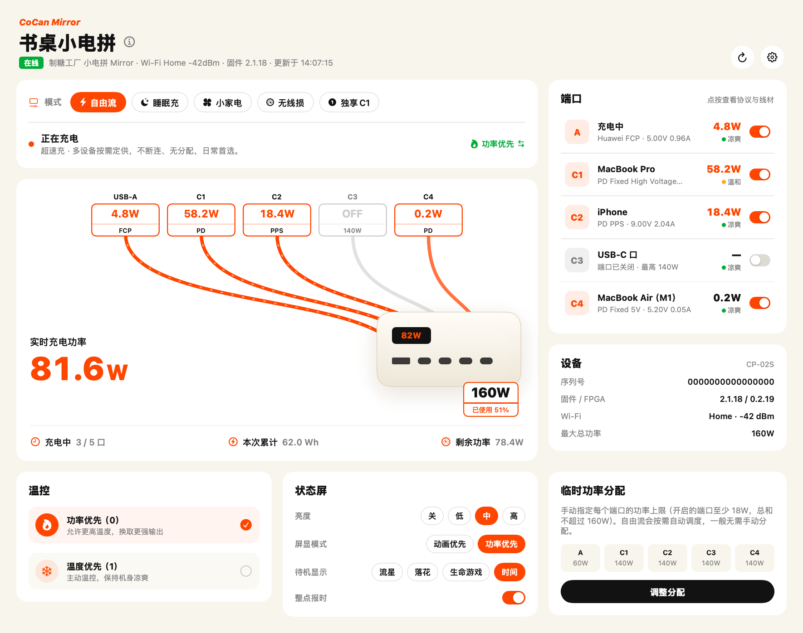
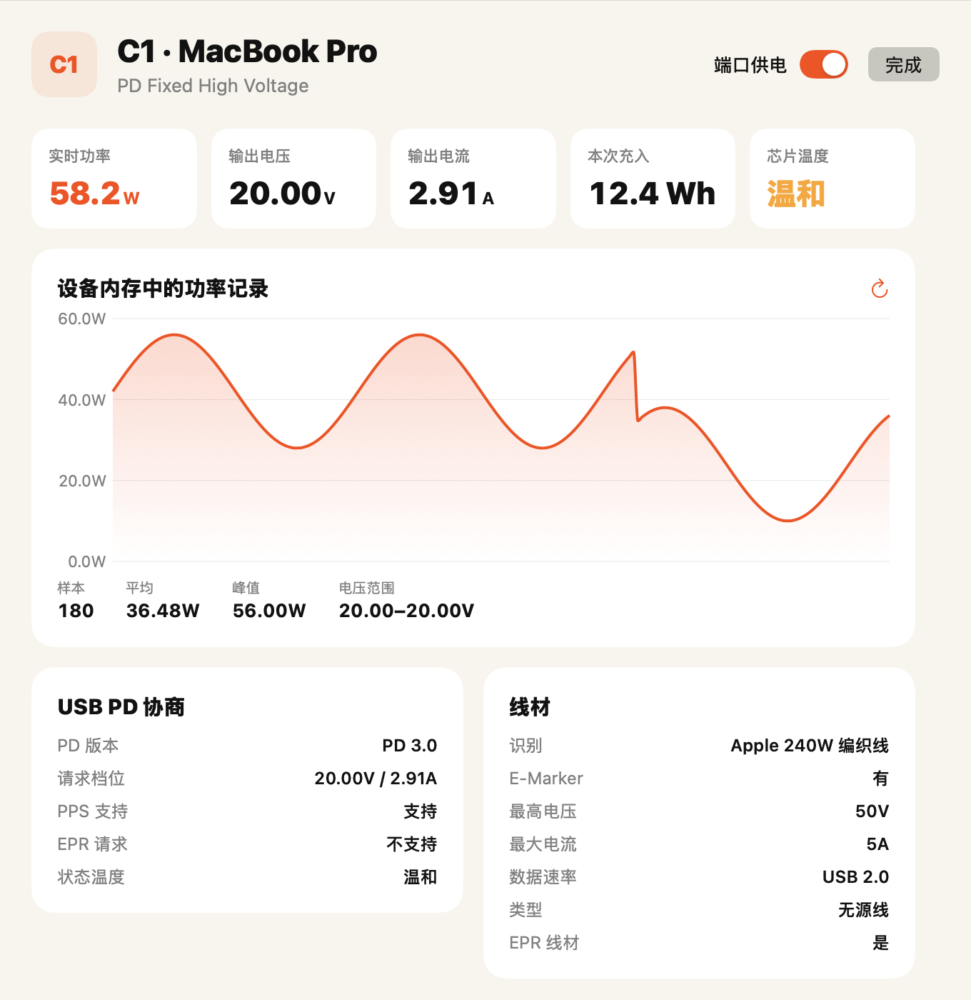
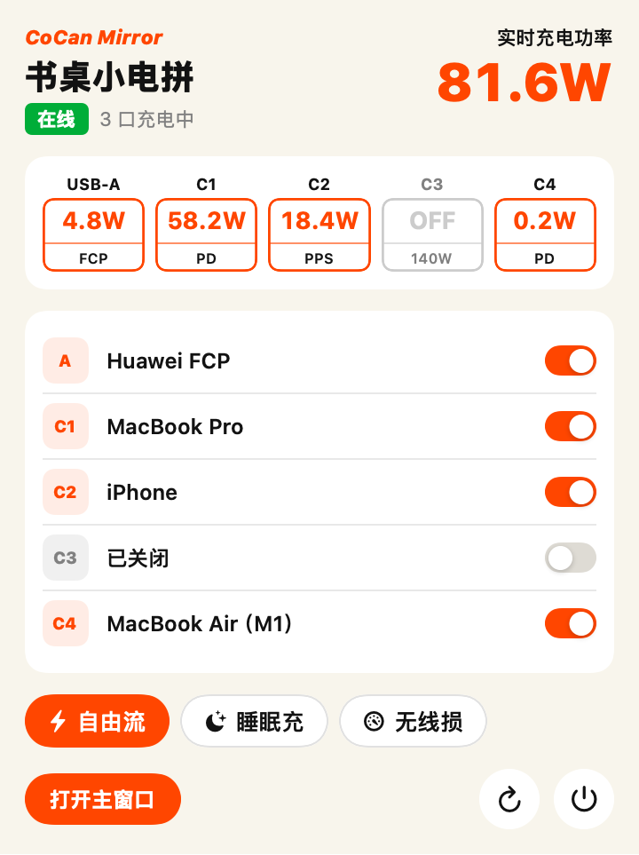
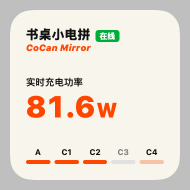
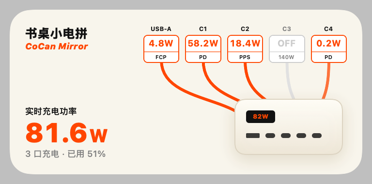
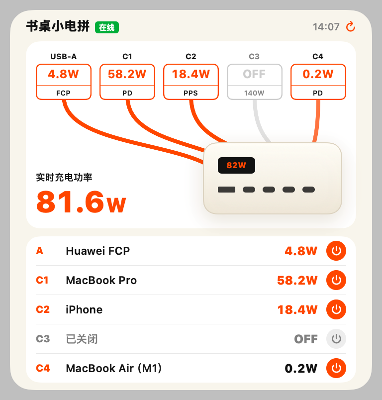

# Kang Charge

[English](README.md) | **简体中文**

**制糖工厂 CANDYSIGN 小电拼的原生 macOS 控制台**：实时功率、端口开关、充电模式、温控、状态屏，外加菜单栏面板和桌面小组件。

非官方第三方项目，通过小电拼官方提供的 MCP 接口通信，不需要改动设备。

[功能](#功能) · [安装](#安装) · [首次设置](#首次设置) · [隐私与安全](#隐私与安全) · [工作原理](#工作原理)



> 截图使用内置的示例数据，不是真实设备读数。

## 功能

- **实时总览**：五个端口的功率、电压、电流、快充协议、芯片温度，以及官方 App 同款的「端口 → 线缆 → 充电器」示意图。
- **控制**：开关单个端口（正在充电的端口会先确认），切换充电模式（自由流、睡眠充、小家电、无线损、独享 C1），切换温控（功率优先 / 温度优先），临时功率分配。
- **端口详情**：USB PD 协商档位、PPS/EPR 支持、线材 E-Marker 信息，以及设备内存里的功率曲线。
- **状态屏设置**：亮度、屏显模式、待机画面、整点报时（后三项仅 CP-02S / Mirror 支持）。
- **菜单栏**：标题栏常驻总功率，点开即可开关端口、切换模式。
- **桌面小组件**：小 / 中 / 大三种尺寸，大尺寸可以直接点按开关端口。
- **快捷指令**：「刷新状态」「切换充电策略」「开关端口」可在快捷指令 App 里组合使用。

| 端口详情 | 菜单栏 |
| --- | --- |
|  |  |

| 小 | 中 | 大 |
| --- | --- | --- |
|  |  |  |

## 系统要求

- macOS 14 Sonoma 或更新版本
- 一台已联网（Wi-Fi）的制糖工厂小电拼，已在 CANDYSIGN App 中绑定
- 这台小电拼的 **MCP 服务器地址**（见[首次设置](#首次设置)）
- 从源码构建需要 Xcode 16+ 和 [XcodeGen](https://github.com/yonaskolb/XcodeGen)

目前主要在 **小电拼 Mirror（CP-02S，5 口 160W）** 上测试。其他型号只要提供同一套 MCP 工具，理论上也能用，端口数量和功率上限会从设备读取。

## 安装

目前需要从源码构建（签名公证后的安装包会发布在 [Releases](../../releases)）。

```bash
git clone https://github.com/LeiZiKang/KangCharge.git
cd KangCharge
brew install xcodegen
cp Config/Local.xcconfig.example Config/Local.xcconfig
```

编辑 `Config/Local.xcconfig`，填入你自己的 Apple 开发者 Team ID 和包名前缀（免费的个人团队也可以）：

```
DEVELOPMENT_TEAM = ABCDE12345
BUNDLE_ID_PREFIX = com.yourname
```

然后生成工程并构建：

```bash
xcodegen generate
open KangCharge.xcodeproj   # 在 Xcode 里选 KangCharge scheme，⌘R 运行
```

或者直接用命令行构建并安装：

```bash
xcodebuild -scheme KangCharge -configuration Release -derivedDataPath build/DD build
cp -R "build/DD/Build/Products/Release/Kang Charge.app" /Applications/
```

> 桌面小组件依赖签名和 App Group（`<TeamID>.<包名前缀>.kangcharge`），所以必须设置 Team ID。如果命令行下 Xcode 没有登录账号，在 `Local.xcconfig` 里加上 `CODE_SIGN_STYLE = Manual`，会直接使用钥匙串里的 Apple Development 证书。

## 首次设置

1. 在 CANDYSIGN App 里找到小电拼的 **MCP 接入**，复制 MCP 服务器地址，格式类似：
   ```
   https://mcp.thecandysign.com/<设备序列号>/<访问令牌>/sse
   ```
2. 打开 Kang Charge，把地址粘贴进首次设置页面，可以顺便给设备起个名字，点「连接」。
3. Kang Charge 会先读取一次设备信息，确认地址可用后进入主窗口。

之后可以在 **Kang Charge → 设置（⌘,）** 里更换地址或断开。

### 添加桌面小组件

在桌面空白处右键 → **编辑小组件**，搜索「Kang Charge」，拖到桌面即可。小组件大约每 5 分钟刷新一次；打开 App 时会更快同步。

## 隐私与安全

- MCP 地址里包含**设备序列号和访问令牌**，拿到它的人可以控制你的小电拼。请当作密码对待，不要截图分享，也不要提交到任何仓库。
- Kang Charge 只把地址保存在本机的 App Group 沙盒里（App 和小组件共用），仓库里没有任何默认地址。
- 所有网络请求只发往你填写的 MCP 服务器，没有统计、没有第三方服务。
- 在设置里点「断开并清除数据」会删除地址和所有缓存。

## 使用须知

- **关闭端口会立即断电**。给正在充电的端口断电前，App 会弹窗确认。
- **小家电模式**会让 C4 口断电重连；**独享 C1** 会关闭其他所有端口。
- MCP 接口能设置充电策略，但**没有读取当前策略的工具**。所以模式高亮显示的是「最近一次在 Kang Charge 里选的模式」，在官方 App 里切换的不会同步过来。
- 数据经 CANDYSIGN 云端转发，刷新有 1~3 秒延迟；设备离线时显示最近一次的缓存。

## 工作原理

小电拼通过 Wi-Fi（MQTT）连到 CANDYSIGN 云端，云端的 `ionbridge-mcp` 服务把设备能力包装成 18 个 [MCP](https://modelcontextprotocol.io) 工具。Kang Charge 自带一个轻量 MCP 客户端，使用 HTTP + SSE 传输：

1. `GET …/sse` 打开事件流，收到 `endpoint` 事件（带 sessionId 的 POST 地址）；
2. 通过 POST 发送 JSON-RPC（`initialize`、`tools/call` …），结果从 SSE 流推回，按请求 id 配对；
3. 连接断开或 session 过期时自动重连。

几个需要换算的字段：端口功率 = `vout_mv × iout_ma ÷ 10⁶` W；`status_bitmask` 的第 n−1 位表示端口 n 是否开启；PD 的 `operating_voltage` / `operating_current` 单位是 10 mV / 10 mA。

```
Shared/            App 与小组件共用
  MCPClient.swift    SSE 传输、JSON-RPC 配对、重连
  ChargerAPI.swift   类型化的工具封装、本地配置与快照缓存
  Models.swift       返回结构与模式定义
  Intents.swift      App Intents（小组件按钮与快捷指令）
  CableDiagram.swift 端口芯片 + 线缆 + 充电器示意图
  Theme.swift        配色与通用组件
App/               主窗口、菜单栏、设置、首次设置、轮询状态
Widget/            TimelineProvider 与三种尺寸的小组件
Config/            xcconfig：签名与包名（个人配置在 Local.xcconfig）
scripts/           图标生成、README 截图、发布脚本
```

## 开发

- `scripts/screenshots.sh`：用内置示例数据渲染 README 里的截图，不需要真实设备。
- Debug 构建支持启动参数 `-kcDemo YES`（示例数据，不联网）和 `-kcSnapshot YES`（把界面渲染成 PNG）。
- `scripts/release.sh`：构建 Developer ID 签名、公证后的 zip，用于发布 Release。
- 修改 `project.yml` 后记得重新运行 `xcodegen generate`。

欢迎提 Issue 和 PR，特别是其他型号（CP-02 等）的测试反馈。

## 免责声明

本项目与制糖工厂 / CANDYSIGN 没有任何关联，也未获得其认可。「CANDYSIGN」「制糖工厂」「小电拼」「CoCan」「FluxAI 自由流」等名称和商标归其各自所有者所有。界面风格参考了官方 App，仅为了让用户有一致的使用体验。使用本软件控制设备的风险由使用者自行承担。

## 许可证

[MIT](LICENSE)
